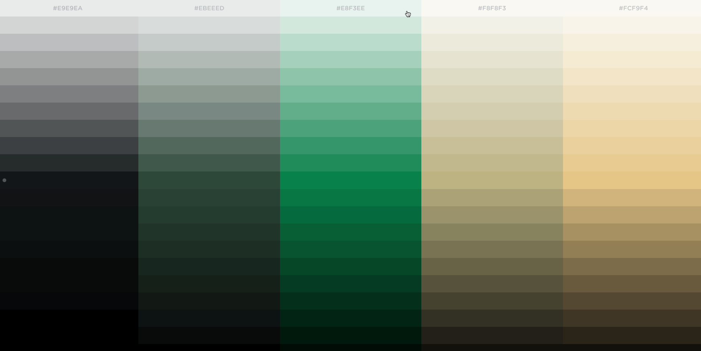
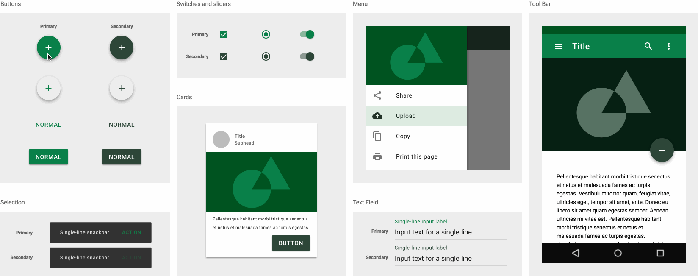

<h1 align="center">
  trifold
</h1>
<h4 align="center">
  A Pokémon-inspired protein folding game.
</h4>

<p align="center">
  <a href="https://travis-ci.org/jdecked/trifold">
    
  </a>
  <a href="https://twitter.com/jdecked">
    
  </a>
</p>


## A Detour For Design
### Color Palette


### Color Palette Example with Material Design


## Running Instructions
Note that this repository is one of three repositories for the microservices involved in Trifold; the other two repositories host the [frontend code](https://github.com/jdecked/trifold-client) and the [backend code](https://github.com/jdecked/trifold-api), so go there if you're looking to peruse the JavaScript/Python source code.

That said, assuming you already have both git and Docker installed:
```
$ git clone https://github.com/jdecked/trifold
$ git clone https://github.com/jdecked/trifold-client
$ git clone https://github.com/jdecked/trifold-api
$ cd trifold
$ docker-compose build
$ docker-compose up
```

Navigate to `http://localhost/` in your browser to see Trifold up and running. Note that this won't work without you first setting the appropriate DJANGO_SECRET_KEY, REACT_APP_OAUTH_CLIENT_ID, and CLIENT_ID environment variables. If you don't have them, [email me](mailto:justine@minerva.kgi.edu) to get them.